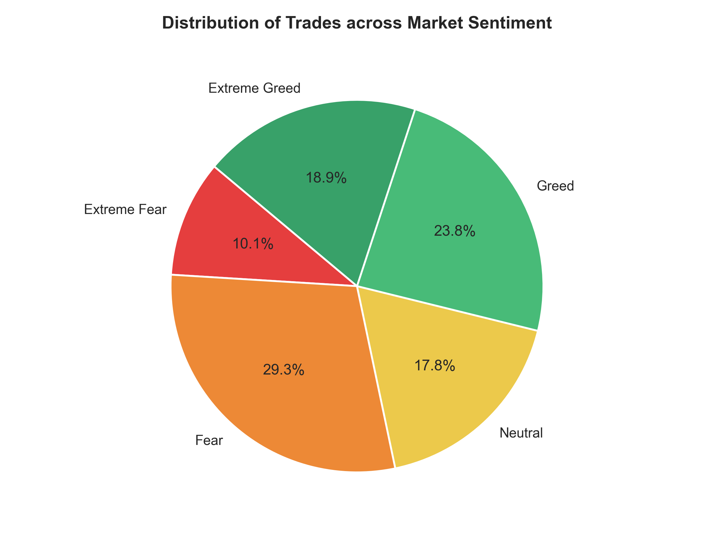
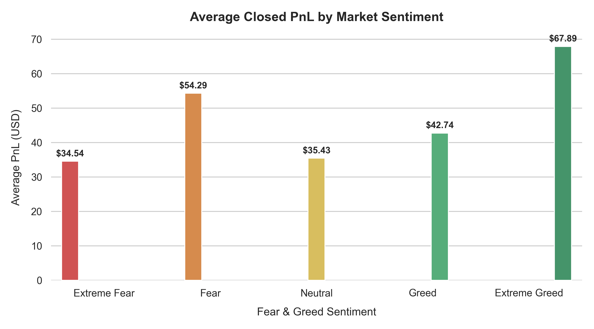
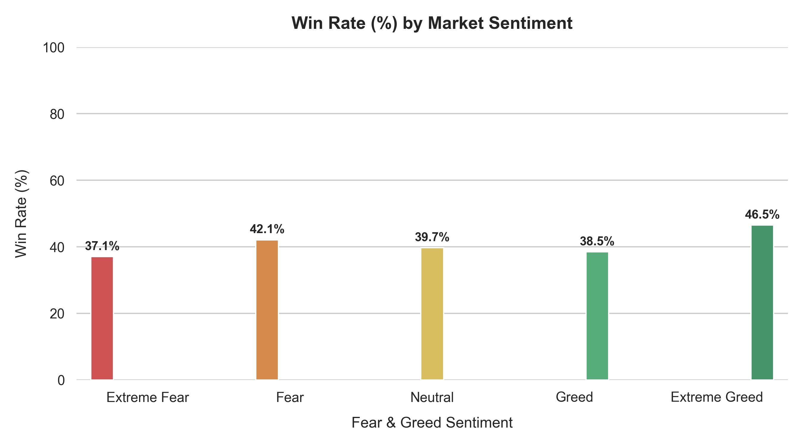
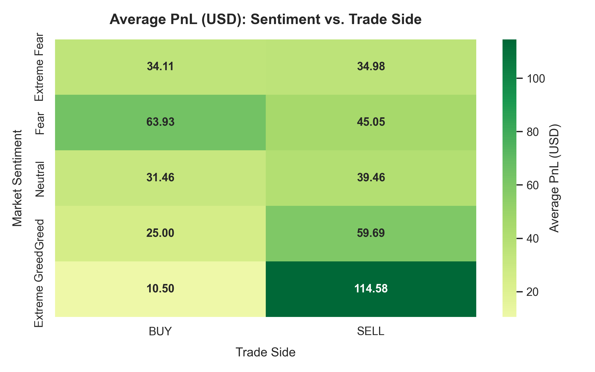
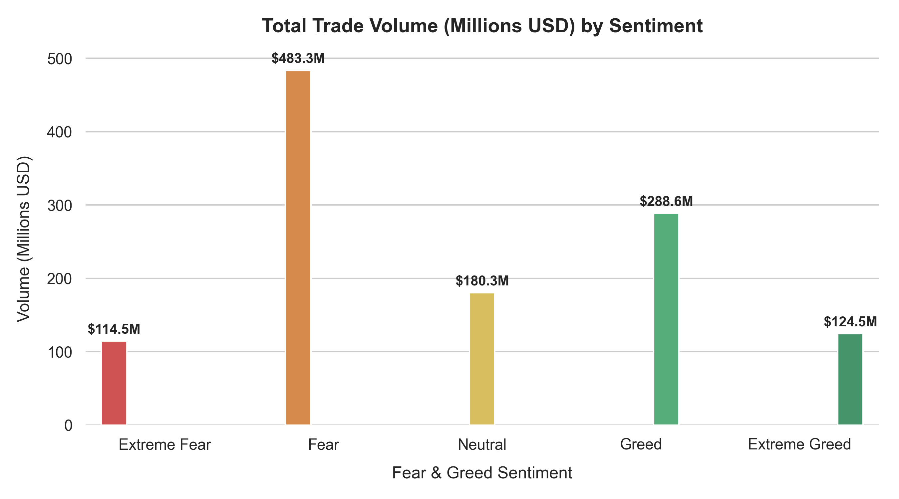
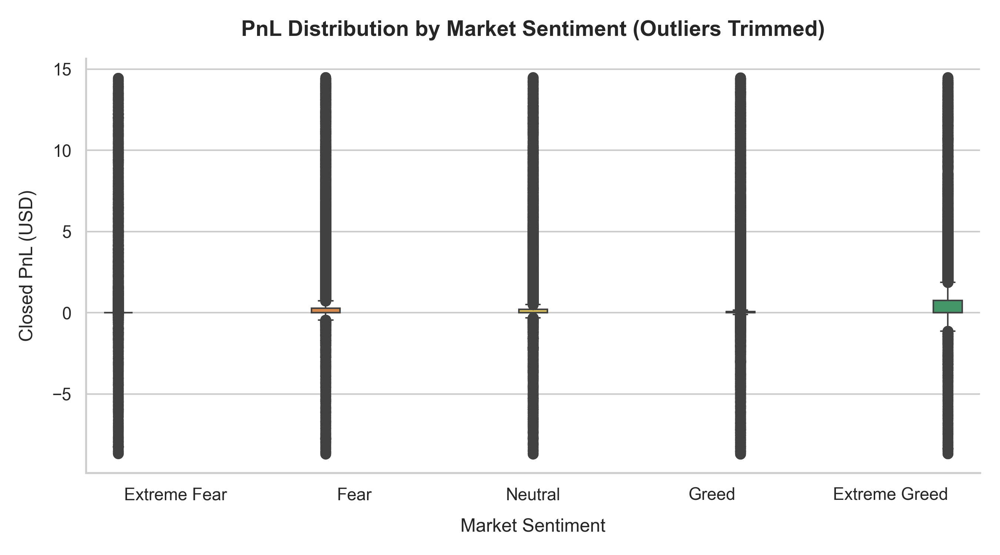

# Trader Sentiment Analysis (Fear & Greed Index)

This repository analyzes trader performance relative to the daily Fear & Greed Index. The included script and notebook merge daily sentiment data with historical trades and produce visualizations that summarize PnL, win rates, volumes, and more.

**Contents**

- `generate_analysis.py` — Main script to generate charts and a notebook.
- `trader_sentiment_analysis.ipynb` — Jupyter notebook version of the analysis.
- `fear_greed_index.csv` — Daily fear & greed index source data.
- `historical_data.csv` — Historical trades dataset used for analysis.
- Generated charts (embedded below):
  - `1_sentiment_distribution.png`
  - `2_average_pnl.png`
  - `3_win_rate.png`
  - `4_buy_sell_heatmap.png`
  - `5_trade_volume.png`
  - `6_pnl_distribution.png`

## Quickstart (Windows)

1. Create and activate a virtual environment:

```powershell
python -m venv .venv
.venv\Scripts\Activate.ps1
```

2. Install dependencies:

```powershell
pip install pandas numpy matplotlib seaborn reportlab
```

3. Run the analysis script:

```powershell
python generate_analysis.py
```

The script will generate the charts listed above in the repository root and update the notebook if necessary.

## Preview

Sentiment distribution:



Average PnL by sentiment:



Win rate by sentiment:



Buy vs Sell heatmap:



Trade volume:



PnL distribution:



## Notes

- The script expects `fear_greed_index.csv` and `historical_data.csv` to be present in the same folder.
- Charts are saved as high-resolution PNGs (300 dpi).

---

If you'd like, I can also add a `requirements.txt`, a short license, or expand the README with sample outputs and interpretation notes.
